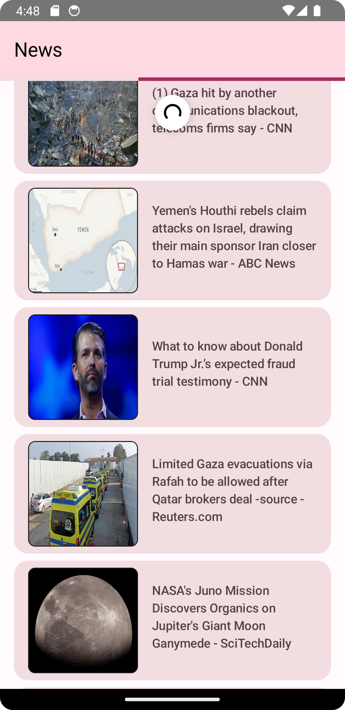
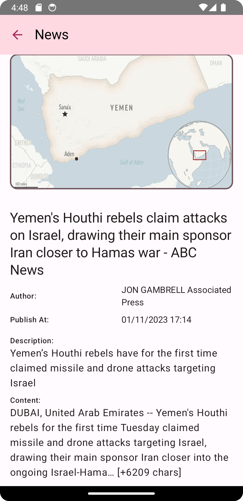

# Meal Recipe App

A News App for Android, build with Native Kotlin & Jetpack Compose

# Feature
 - News
 - Detail

# Screenshoot

    
    
    

# Tech Stack

- Kotlin
- Jetpack Compose
- Jetpack Compose Navigation
- Compose Destination
- Material Design 3
- Coroutine
- Kotlin Flows
- Paging 3
- Kotlinx Datetime
- Coil
- Hilt,
- Ktor Client
- MVVM
- Clean Architecture
- Modularization

# Installation

- Get your KEY API from <a href="https://newsapi.org" target="_blank">here</a>
- Add Key API to local.properties ex: API_KEY=[your APIKEY]
- rebuild & compile on Android Studio